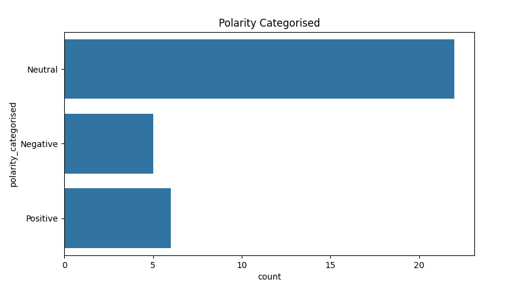
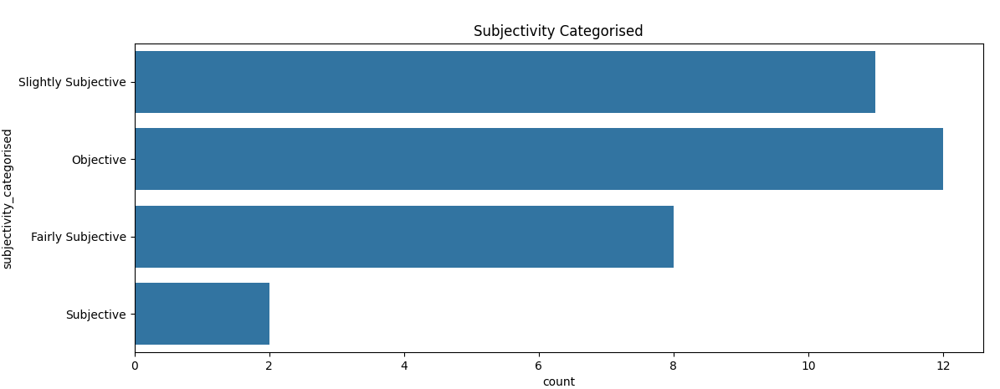
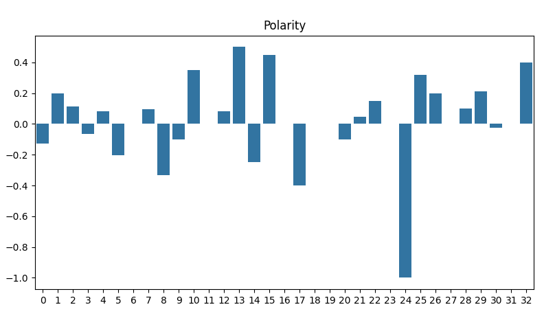
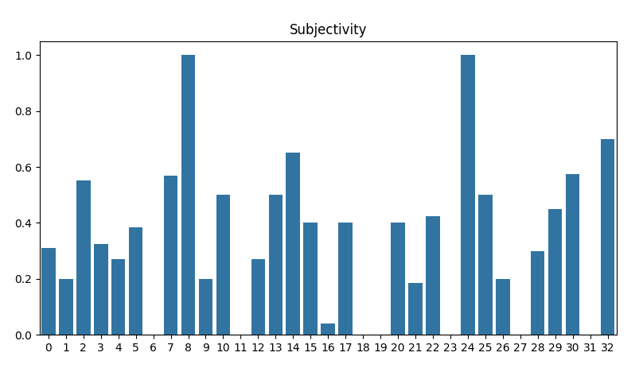

# News Headline Sentiment Detector

This is a simple Python script that pulls recent articles from BBC's RSS feed and, using the titles and descriptions of the articles, displays the polarity (how positive or negative the articles are) and the subjectivity, as well as a wordcloud to see the most common keywords.

## Usage
First, open a terminal and navigate to the project directory.

Install dependencies: (Using a virtual environment is reccomended but not necessary)
```bash
pip install -r requirements.txt
```

To run the script, use this command:
```bash
python main.py
```

## Example Output
(As of 26th of September, 2025)

### Wordcloud


### Polarity Categorised


### Subjectivity Categorised


### Polarity


### Subjectivity

